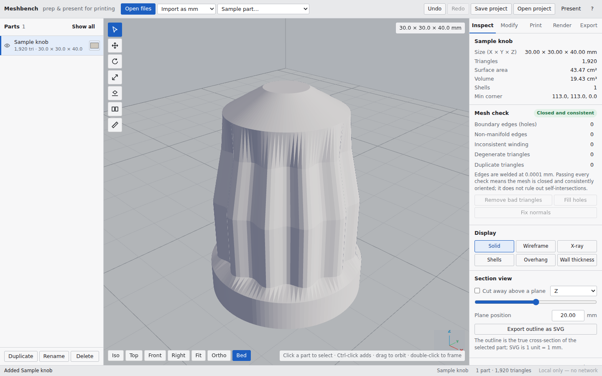
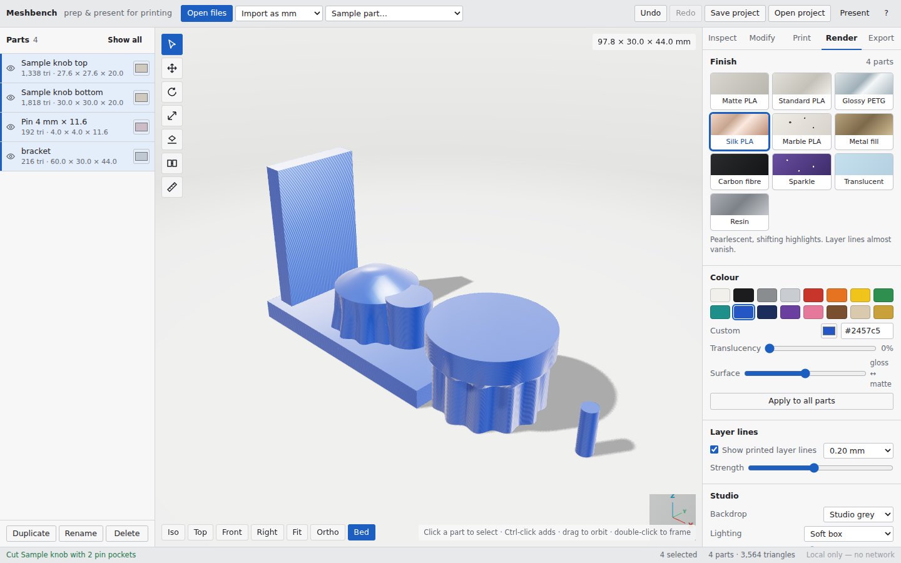
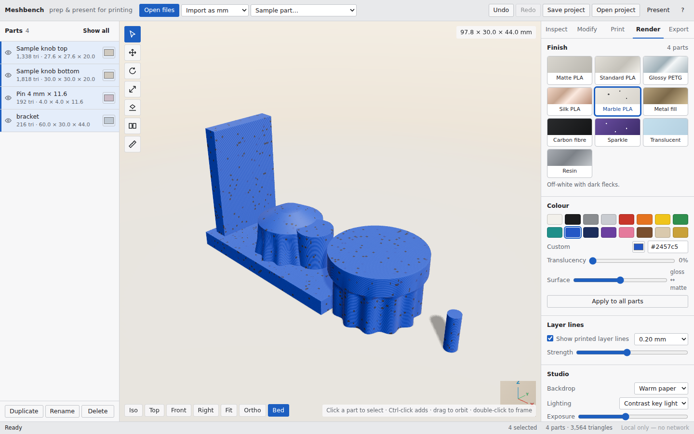
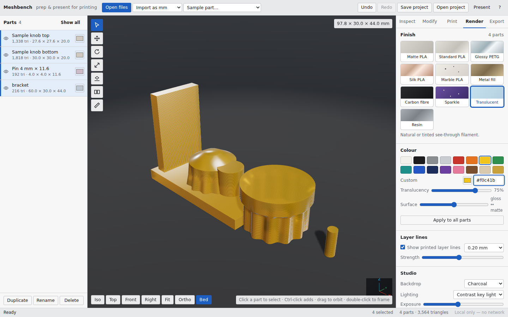

# Meshbench 2.0

Offline, single-file mesh prep and presentation for 3D printing. Open `dist/meshbench.html` in any modern browser: no server, no network, no install. Everything (three.js r186, the geometry core, the web worker, the styles) is bundled into that one HTML file.



## What it does

**Import** STL (binary and ASCII, truncated files are salvaged), OBJ, and 3MF (including `<components>` with transforms and the unit attribute). Units can be forced on import (mm, cm, m, inches).

**Inspect**: closed/open, non-manifold edges, inconsistent winding, degenerate and duplicate triangles, shell count, volume, surface area, bounds. Defect edges are drawn on the model. Lenses: overhang shading (at the current angle), wall thickness, shells. Section view along any axis with SVG export of the cut outline. Measure between points with vertex snapping.

**Repair**: clean (drop degenerate and duplicate triangles), fill holes, fix normals (unify winding, flip inside-out shells), split shells into parts.

**Modify**: move / rotate / scale gizmo with optional snapping (1 mm, 15°, 5 %), numeric transforms, lay a picked face on the bed, mate two flat faces (planar region grow, with a gap), mirror, inches→mm, flip, bake transforms into the geometry.

**Cut**: plane cut on any axis at any position with an optional tilt; each shell is capped separately so overlapping shells (like the sample bracket) come out closed. Optional dowel pin pockets are added to both halves and a matching pin is generated. Halves can be laid cut-face down automatically.

**Print**: bed presets (Bambu X1/P1, A1 mini, Prusa MK4/MK3, Prusa Mini, Ender 3, custom), fit report, arrange all parts on the bed, drop to bed, orientation ranking (overhang area, bed contact, height), material and cost estimate.

**Render** (new): present the part as it would look printed. Finish presets: matte, standard, glossy, silk, marble, metal, carbon, glitter, clear, resin. 16 filament colour swatches plus any colour, translucency and roughness sliders, layer lines at any layer height, four studio backdrops (studio, warm, white, dark) and a transparent option, lighting presets, exposure, ground shadow, turntable, smooth shading. Export a PNG at 1–4× or copy it to the clipboard. Present mode (Tab) hides the panels.

| Silk | Marble | Clear |
| --- | --- | --- |
|  |  |  |

**Export**: STL, 3MF (all parts, with names and colours), SVG section, and a project file (`.mbench.json`) that keeps geometry, transforms, colours, finishes and the studio setup. Undo/redo across everything.

## Layout

```
meshbench/
  src/
    geometry.js   pure, dependency-free geometry core (parse/write, weld, topology, BVH,
                  thickness, overhang, orientation, plane cut + caps, pockets, hole fill, samples)
    ops.js        the operations the worker (or the main-thread fallback) runs
    worker.js     Web Worker entry: geometry + earcut + ops
    materials.js  finish presets, filament swatches, layer-line shader injection, backdrops
    app.js        the UI: scene, tools, panels, history, import/export, render mode
    index.html    markup (panels, tabs, modals)
    styles.css
  scripts/
    build.mjs     esbuild → dist/meshbench.html (worker inlined as text/plain, three bundled)
    smoke.mjs     headless Chromium smoke test (software WebGL) with screenshots
  test/
    geometry.test.mjs   node:test unit tests for the geometry core
  dist/meshbench.html   the deliverable
```

Design points:

- **Z-up, millimetres**, like slicers. `THREE.Object3D.DEFAULT_UP` is set to +Z once at boot.
- **Geometry core is pure JS** with no three.js dependency, so it runs identically in the worker, in Node tests, and on the main thread. Meshes are flat `Float32Array` triangle soups (9 floats per triangle). Welding uses a numeric open-addressing hash; edge keys are numeric (`min * nV + max`), never strings.
- **Heavy work runs in a Web Worker** (topology, clean, fill, unify, split, thickness, orientation, cut, section, 3MF write) with transferable buffers. If workers are unavailable (some `file://` sandboxes) the same ops run on the main thread.
- **Cut capping** groups the section polygon by shell, triangulates each shell's loops with earcut, then splits cap triangles at T-junctions and drops slivers so the halves are watertight even for overlapping shells.
- **Render mode** swaps every part to a `MeshPhysicalMaterial` driven by a preset (sheen, iridescence, transmission, metalness, speckle) with an `onBeforeCompile` injection that ripples the normal along world Z for layer lines. Lighting is a PMREM room environment plus key/fill/rim lights and a shadow catcher. The backdrop is an in-scene sphere so three's transmission pass sees it through translucent parts. Smooth shading uses creased normals (40°) so hard edges stay hard.

## Build and test

```
cd meshbench
npm install
npm run check     # unit tests → build → headless smoke test
```

- `npm test` — 22 unit tests for the geometry core (parsers, weld, topology, repair, cut, pockets, overhang, orientation, thickness, 3MF round trip, SVG).
- `npm run build` — writes `dist/meshbench.html` (~950 KB). `--dev` skips minification.
- `npm run smoke` — drives the built file in headless Chromium: worker mesh check, STL import, cut with pockets, render tab (three finishes), PNG export, undo, 3MF round trip, lenses/section/orientation/arrange, mate via real canvas clicks, fill holes and project round trip. Screenshots go to `screenshots/`.

## Code review of the original Meshbench (what changed and why)

The original was a single hand-written HTML file with three.js r128 inlined. Findings, all addressed here:

| Finding | Fix |
| --- | --- |
| Cut laid the wrong half cut-face down (the "above" half was rotated with the "below" half's rotation). | Each half gets its own rotation: above uses `-n → down`, below uses `n → down`. Covered by the smoke test (both halves have ≥300 mm² bed contact). |
| All topology ran on the main thread; a 1M-triangle STL froze the UI. | Web Worker with transferables, cached per geometry version, main-thread fallback. |
| Weld and edge maps used string keys (`x,y,z` and `a_b`), several times slower and GC heavy. | Numeric open-addressing hash for welding, numeric edge keys, union-find shells. |
| 3MF import ignored `<components>`, transforms and the unit attribute, so assemblies imported as a single wrong-scale mesh. | Full component recursion with composed affine transforms and unit scaling (unit test). |
| Truncated binary STLs were rejected outright. | Whole triangles are salvaged and the part is flagged. |
| No way to fix inconsistent winding or inside-out shells. | "Fix normals" (`unifyNormals`) propagates orientation across each shell and flips shells with negative volume. |
| Cut caps had T-junctions and overlapping shells produced open halves. | Per-shell capping, T-junction splitting, sliver removal (unit tests on the tilted bracket cut). |
| Raycast picking went through three's per-triangle loop with no acceleration. | Iterative BVH in the core, also used for thickness and inside tests. |
| No mate tool, no snapping, no measurement snapping. | Added mate faces (planar region grow), gizmo snapping, vertex snapping for measure. |
| three.js r128 UMD, deprecated APIs (`Geometry`, old `TransformControls` API). | three r186 ESM bundled by esbuild; `TransformControls` helper added to the scene per the new API; `PCFShadowMap`. |
| No tests. | 22 unit tests plus a headless browser smoke test with screenshots. |
| No presentation of the printed result. | The Render tab. |

## Comparison with DATUM (the Grok version in `src/`)

DATUM is a TanStack Start + React 19 app (three ^0.186, Tailwind 4, auth, PGLite, Vercel deploy scaffolding) with a Y-up, STL-only viewer.

| | DATUM (`src/`) | Meshbench (`meshbench/`) |
| --- | --- | --- |
| Runs as | Dev server / deployed site, login | One HTML file, offline |
| Up axis | Y-up (converted on export) | Z-up, matches slicers |
| Formats | STL | STL, OBJ, 3MF (components), project file |
| Repair | – | Clean, fill holes, fix normals, split shells |
| Cut | – | Plane cut with caps, pockets and pins |
| Analysis | Overhang shading | Overhang, wall thickness, shells, section + SVG, thickness map |
| Orientation | – | Ranked candidates |
| Mate faces | Yes | Yes |
| View cube / camera animation | Yes | Animated views + axis triad (no cube) |
| Lock / isolate / explode | Yes | Hide/show, isolate via Show all |
| Render / presentation | Matcap clay | Physical materials, filament finishes, layer lines, studio, PNG export |
| Tests | – | Unit + headless smoke |

DATUM's structure (`engine.ts` for the scene, `mesh-ops.ts` for transforms, `topology.ts` for connectivity) is sound, and its view cube and lock/isolate/explode workflow are worth porting over. Meshbench deliberately stays a single file with no framework so it can be emailed, dropped on a USB stick, or opened from a slicer's folder.

## Keyboard

`Q` select · `G` move · `R` rotate · `S` scale · `L` lay on face · `T` mate · `M` measure · `F` fit · `P` ortho · `1–4` views · `B` drop to bed · `C` centre · `X` section · `H` hide · `O` open · `Tab` present · `Ctrl+Z/Y` undo/redo · `Ctrl+S` save project · `Ctrl+D` duplicate · `Del` delete · `F2` rename · arrows / PgUp / PgDn nudge (Shift = 1 mm) · `?` shortcuts.
